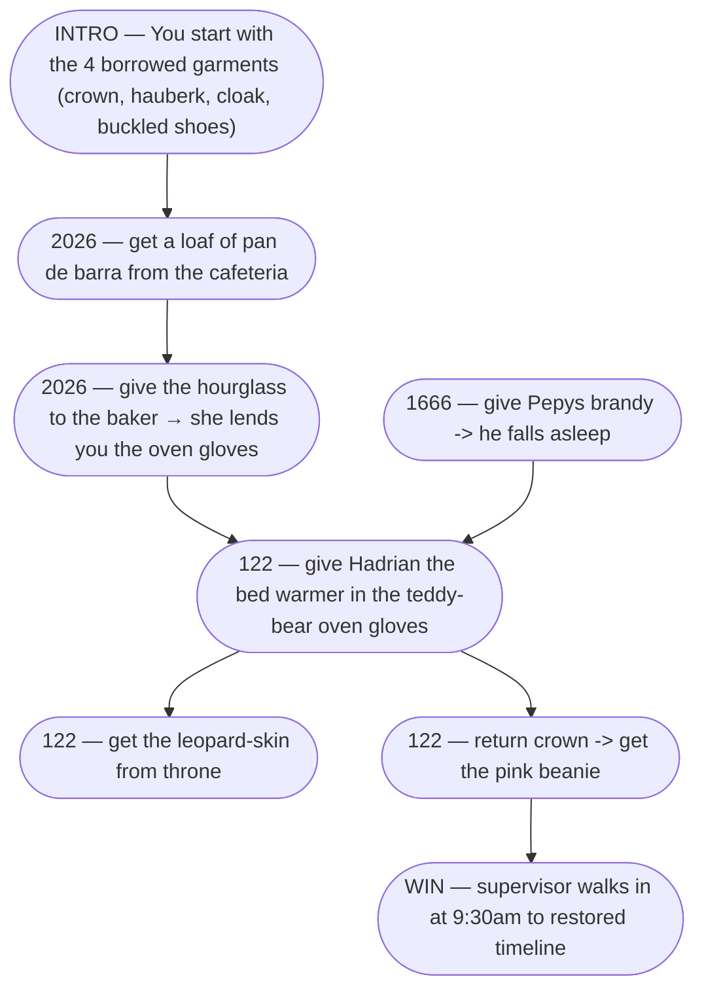

Date: 2026-10-01 20:00
Title: A Puzzling Conversation
Category: posts
Friendly_Date: on an unseasonably warm October afternoon
Tags: gamedev, ai, llms, mermaid, pyweek

PyWeek 42's theme was "Borrowed Time". I've wanted to make a point-and-click
adventure for a while, so I gave it a go with a stupid plot about returning the
borrowed components of a fabulous fancy-dress costume to their proper time zones
before the timeline falls apart.

I love the LucasArts adventure games - Monkey Island, Indiana Jones: Fate of
Atlantis, Sam and Max Hit the Road - and Ron Gilbert is one of my gamedev
heroes. The theme brought to mind the time-hopping puzzles of Day of the
Tentacle, and the idea of making something like that hooked me.

## It All Depends

To design the interconnected game puzzles, I used a [Puzzle Dependency Chart
(PDC), as described by Gilbert on his blog][3]. A PDC is a graph of every puzzle
and puzzle step in the game, with an edge from each step to the steps that make
it possible. It is not a flow chart. Rather than "what happens next", a PDC
shows "what does this _depend_ on".

Gilbert's advice is to start from the end of a puzzle chain, and keep asking
"what has to happen before this can?". In his example, the goal "Open Basement
Door" requires that you both unlock it and oil the hinges - two dependencies
because, as Gilbert says, "There is nothing (NOTHING!) worse than linear
adventure games".

A PDC has a characteristic shape. Solving one puzzle opens up two or three new
ones, and those collapse into a single solution that opens up the next batch. A
sub-diamond of expansion and contraction, repeated.

A bad design shows up at a glance: too linear and it's boring, too branchy and
it's confusing.

With my game goal set, I was ready to work backwards and build my PDC.

## Talking to Mermaids

Gilbert uses the [OmniGraffle app][6] for drawing charts visually. I'd have to
learn it from scratch, so I used my tame AI[^1] to build the chart, describing
what I wanted and letting it turn that description into [Mermaid][7] markup.

My chart is a single Mermaid block in a markdown file, viewed in [MDV][1], which
live-reloads when the file changes. Here's a fragment of it:

I had heard about developers [talking to their AI][8] and I thought it sounded
like a laugh, so I used [SuperWhisper][2], which transcribes what I say and
types it directly into the current app — in this case a terminal running
[pi-dev][4] connected to my local LLM. Any coding agent that can edit files will
do. Pi edits the Mermaid block, MDV reloads, and the chart on screen reflects
what I just said.

It was a productive and enjoyable way to work.

I would say something like this (real transcript excerpt!):

> "The step where Raleigh presents the queen with the leopard skin rug, uh, to
> getting the denim jacket back from the queen, that's kind of one step
> because he gives her the leopard skin, she puts it on and drops the denim
> jacket, allowing you to collect it."

and Pi would modify the Mermaid code to merge the two nodes into one and rewire
the edges. I just watched the graph change.

But beyond having the agent translate my mumblings into Mermaid markup, I
prompted it to always check that the chart had no open ends and aligned with
Gilbert's advice on the shape of a "good" PDC. When I left a dependency vague —
"the player needs to know Raleigh is in that cell" — the agent asked how the
player learns this. And it warned if a section was too linear, or when too many
puzzles were open at once.

Here's the full PDC I built in this way:

One mildly annoying thing the AI kept doing was suggesting solutions to puzzle
dependencies - its suggestions were usually horrible. AIs, even frontier ones,
are [weak at reasoning about the world][9] and just aren't funny. I think it's
best to keep the creative work in human hands. I could have asked it to only ask
questions, but the bad suggestions gave me a starting point for better ideas.

## I'd Like to Thank My Agent

I may be a curmudgeon, but I do not like to let AI code for me. Getting a model
to write code is corrosive to my ability to read, write and reason about it.
It's worse than getting rusty. You learn to stop thinking and ask the AI.

But this wasn't that. Learning Mermaid syntax by hand would not have improved my
game design any more than installing OmniGraffle would. The value is in the
graph of dependencies — which puzzles should require which steps — and that's
the thing I'm constructing and interacting with, not the Mermaid file.

I gained two benefits:

1. The feedback loop. Dictation is much faster than pointing and clicking
   boxes. I can spend my time thinking about what puzzles and story beats work
   instead of how to join two nodes with an edge. The chart changes as I speak,
   so the gap between having an idea and seeing it is almost instant.

2. The Socratic method. The agent asked questions and made bad suggestions, and
   I had to explain, correct and develop my thinking in response. It's the
   [talking rubber-duck][10] again. Rather than doing my thinking for me, _the
   AI prompted me_ to think more.

## Time Flies

I ran out of time to submit, sadly. As ever, it was the art that took all the
time — even after I gave up and asked ChatGPT to do it (I have no art skills to
corrode).

But the PDC was the most fun part of the whole build. Raw creation, working
backwards from the goal, figuring out the crazy dependencies the player has to
untangle. Some of them are nasty.

If you ever make an adventure game, you can't go wrong stealing Ron Gilbert's
ideas. And if you steal mine, you may find yourself in a puzzling conversation
with an AI too.

 

[1]: https://www.mowglii.com/mdv/
[2]: https://superwhisper.com/
[3]: https://www.grumpygamer.com/puzzle_dependency_charts/
[4]: https://github.com/earendil-works/pi
[5]: https://huggingface.co/ukisai/Swift-Qwen3.8-27B-GGUF
[6]: https://www.omnigroup.com/omnigraffle
[7]: https://mermaid.ai/open-source/
[8]: https://www.reddit.com/r/AI_Agents/comments/1u0jx2a/whos_not_whispering_to_their_ai/
[9]: https://opper.ai/blog/car-wash-test
[10]: /posts/a-rubber-duck-that-talks-back/

[^1]: I'm currently running [Swift-Qwen3.8-27B][5] at IQ4_XS on a 7900XTX (24GB
    VRAM), which fits with a decent context window, and I get about 50 tok/s,
    which is very usable.
